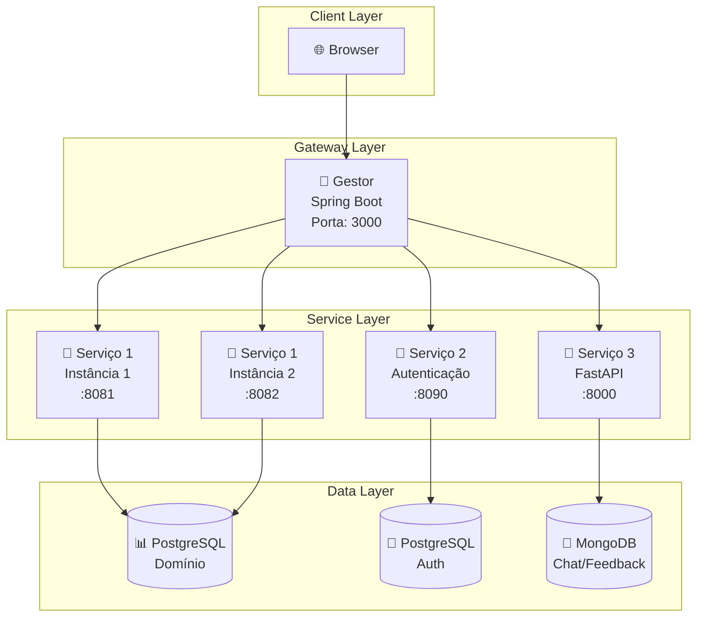
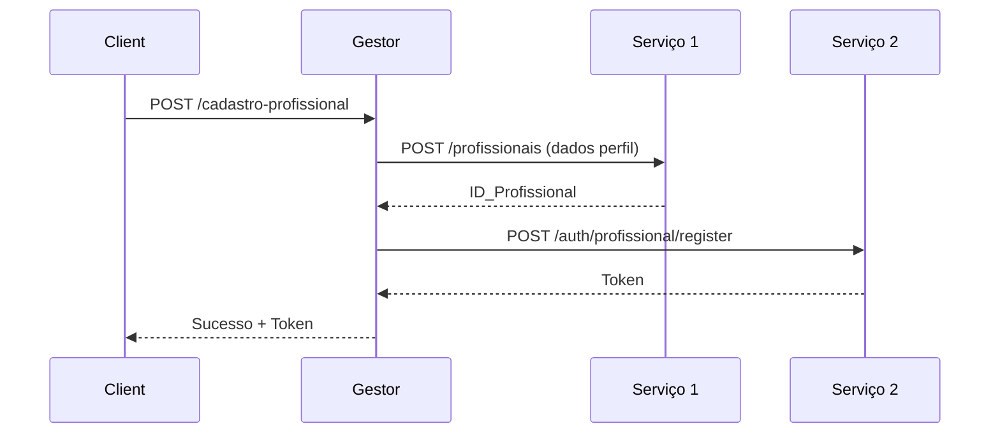

# 🚀 PatroServiçosSD

<div align="center">


**Uma implementação didática para a disciplina de Sistemas Distribuídos**

Monorepo com micro-serviços demonstrando separação de responsabilidades, orquestração, balanceamento (round‑robin) e tolerância a falhas.

[](https://open.vscode.dev/your-repo)
[](CONTRIBUTING.md)

</div>

---

## 📋 Índice Rápido

- [🎯 Sobre o Projeto](#-sobre-o-projeto)
- [⚡ Visão Rápida](#-visão-rápida)
- [🏗️ Arquitetura](#️-arquitetura)
- [📁 Estrutura do Projeto](#-estrutura-do-projeto)
- [🛠️ Stack Tecnológica](#️-stack-tecnológica)
- [🚀 Como Executar](#-como-executar)
- [🔌 API Endpoints](#-api-endpoints)
- [⚖️ Balanceamento & Tolerância](#️-balanceamento--tolerância)
- [💡 Decisões de Projeto](#-decisões-de-projeto)
- [🤝 Contribuindo](#-contribuindo)
- [📄 Licença](#-licença)
- [👨💻 Autor](#-autor)

---

## 🎯 Sobre o Projeto

<div align="center">

*PatroServiçosSD simula um sistema de prestação de serviços com arquitetura distribuída, implementando conceitos fundamentais de sistemas distribuídos em ambiente acadêmico.*

</div>

**Objetivos Principais:**
- ✅ Demonstrar **separação de responsabilidades** entre serviços
- ✅ Implementar **balanceamento de carga** (round-robin)
- ✅ Garantir **tolerância a falhas**
- ✅ Praticar **orquestração entre serviços**
- ✅ Utilizar **bancos de dados heterogêneos**

---

## ⚡ Visão Rápida

| Componente   | Tecnologia   | Função Principal                                |
|--------------|--------------|-------------------------------------------------|
| **Gestor**   | Spring Boot  | Gateway + Frontend + Balanceador                |
| **Serviço 1**| Spring Boot  | Domínio (Profissionais, Clientes)               |
| **Serviço 2**| Spring Boot  | Autenticação & Autorização                      |
| **Serviço 3**| FastAPI      | Chat & Feedbacks                                |

**Bancos de Dados:**
- 🗄️ **Serviço 1 & 2**: PostgreSQL / H2 (dev)
- 🍃 **Serviço 3**: MongoDB

---

## 🏗️ Arquitetura



---

## 📁 Estrutura do Projeto

```
PatroServiçosSD/
│
├── gestor-spring/                 # 🚀 Gateway & Frontend
│   ├── src/main/resources/templates/ # 🎨 Páginas HTML
│   ├── src/main/resources/static/    # 🎭 CSS/JS/Assets
│   └── application.properties        # ⚙️ Configurações
│
├── servico1-spring/               # 🔧 Domínio Principal
│   ├── src/main/java/com/domain/   # 💼 Lógica de Negócio
│   │   ├── controller/             # 🎮 Controladores REST
│   │   ├── service/                # ⚡ Serviços
│   │   └── model/                  # 🏛️ Entidades
│   └── application.properties      # ⚙️ Config DB Domínio
│
├── servico2-spring/               # 🔐 Autenticação
│   ├── src/main/java/com/auth/     # 🔑 Lógica de Auth
│   │   ├── controller/             # 🎮 Endpoints Auth
│   │   └── service/                # ⚡ Serviços Auth
│   └── application.properties      # ⚙️ Config DB Auth
│
├── servico3-python/               # 💬 Chat & Feedback
│   ├── app/                        # 🐍 Código Python
│   │   ├── main.py                 # 🚀 Aplicação FastAPI
│   │   └── models/                 # 🏛️ Modelos MongoDB
│   └── requirements.txt            # 📦 Dependências Python
│
└── README.md                      # 📚 Documentação
```

---

## 🛠️ Stack Tecnológica

### Backend
| Tecnologia   | Versão   | Uso                             |
|--------------|----------|---------------------------------|
| Java         | 17       | Serviços 1, 2 e Gestor          |
| Spring Boot  | 3.1+     | Framework principal             |
| Python       | 3.10+    | Serviço 3 (Chat)                |
| FastAPI      | 0.100+   | Framework Python                |

### Bancos de Dados
| Banco       | Tipo      | Serviço                        |
|-------------|-----------|--------------------------------|
| PostgreSQL  | Relacional| Serviços 1 e 2                 |
| MongoDB     | NoSQL     | Serviço 3                      |
| H2          | In-memory | Desenvolvimento / testes       |

### Frontend
- HTML5 / CSS3 / JS
- Bootstrap 5
- Arquivos estáticos servidos pelo Gestor

---

## 🚀 Como Executar

### Pré-requisitos
- ☕ Java 17+
- 🐍 Python 3.10+ (para Serviço 3)
- 🗄️ Maven 3.6+
- 🍃 MongoDB (opcional para dev)
- 🐘 PostgreSQL (opcional para dev)

### Execução Rápida (sem Docker)

```bash
# 1️⃣ Clone o repositório
git clone https://github.com/seu-usuario/PatroServicosSD.git
cd PatroServicosSD
```

1. Serviço 1 — Instância 1 (porta 8081)
```bash
cd servico1-spring
mvn spring-boot:run -Dspring-boot.run.arguments="--server.port=8081 --INSTANCE_ID=svc1-8081"
```

2. Serviço 1 — Instância 2 (porta 8082) — nova aba/terminal
```bash
cd servico1-spring
mvn spring-boot:run -Dspring-boot.run.arguments="--server.port=8082 --INSTANCE_ID=svc1-8082"
```

3. Serviço 2 — Autenticação (porta 8090)
```bash
cd servico2-spring
mvn spring-boot:run -Dspring-boot.run.arguments="--server.port=8090"
```

4. Serviço 3 — FastAPI (porta 8000)
```bash
cd servico3-python
python -m venv venv
# Linux/Mac:
source venv/bin/activate
# Windows:
# venv\Scripts\activate
pip install -r requirements.txt
uvicorn app.main:app --reload --port 8000
```

5. Gestor — Gateway + Frontend (porta 3000)
```bash
cd gestor-spring
mvn spring-boot:run -Dspring-boot.run.arguments="--server.port=3000"
```

**Acesso**
- Frontend: http://localhost:3000  
- API Gestor: http://localhost:3000/api  
- Serviço 3 (docs): http://localhost:8000/docs

---

## 🔌 API Endpoints

> Obs: o browser/JS deve conversar apenas com o Gestor (ex.: `http://localhost:3000/api/...`).

### 🚀 Gestor (Gateway - Porta 3000)
| Método | Endpoint                                  | Descrição                        | Serviço Destino |
|--------|-------------------------------------------|----------------------------------|-----------------|
| GET    | /api/profissionais                        | Lista profissionais              | Serviço 1       |
| GET    | /api/profissionais/{id}                   | Detalhes profissional            | Serviço 1       |
| POST   | /api/cadastro-profissional-completo       | Cadastro completo (S1 + S2)      | S1 + S2         |
| POST   | /api/auth/cliente/register                | Registro cliente                 | Serviço 2       |
| POST   | /api/auth/cliente/login                   | Login cliente                    | Serviço 2       |
| GET/POST | /api/chats                              | Chat                             | Serviço 3       |
| GET/POST | /api/feedbacks                          | Feedbacks                        | Serviço 3       |

### 🔧 Serviço 1 (Domínio)
```bash
# Health Check
curl http://localhost:8081/actuator/health

# Listar profissionais
curl http://localhost:8081/api/v1/profissionais
```

### 🔐 Serviço 2 (Autenticação)
```bash
# Registrar cliente
curl -X POST http://localhost:8090/api/v1/auth/cliente/register \
  -H "Content-Type: application/json" \
  -d '{"email":"cliente@teste.com","senha":"123456"}'
```

### 💬 Serviço 3 (Chat)
```bash
# Criar chat
curl -X POST http://localhost:8000/api/v1/chats \
  -H "Content-Type: application/json" \
  -d '{"usuario_id":"123","mensagem":"Olá!"}'
```

---

## ⚖️ Balanceamento & Tolerância

### 🎯 Demonstração Prática (round-robin)
```bash
for i in {1..6}; do
  curl -i http://localhost:3000/api/profissionais | grep "X-Instance-Id"
done
```

Saída esperada (alternando entre instâncias):
```
X-Instance-Id: svc1-8081
X-Instance-Id: svc1-8082
X-Instance-Id: svc1-8081
X-Instance-Id: svc1-8082
```

### 🔧 Tolerância a Falhas
- Pare uma instância do Serviço 1 (Ctrl+C).
- Continue fazendo requests para o Gestor — ele deve usar a instância saudável.
- Health-check periódicos reabilitam instâncias quando voltam.

---

## 💡 Decisões de Projeto

### 🎯 Simplificações para Entrega Rápida
| Área         | Decisão                        | Justificativa                        |
|--------------|--------------------------------|--------------------------------------|
| Autenticação | Token UUID em memória          | Simplicidade vs implementar JWT      |
| Formulários  | Único para profissional        | Menos telas; orquestração S1 + S2    |
| Uploads      | Strings/paths                  | Evita complexidade de armazenamento  |
| Frontend     | Servido pelo Gestor            | Evita CORS e simplifica deploy       |

### 🔄 Orquestração de Cadastro (fluxo)


---

## 🤝 Contribuindo

<div align="center">
Contribuições são bem-vindas! 🎉
</div>

### 📋 Como Contribuir
1. Fork o projeto
2. Crie uma branch:
```bash
git checkout -b feature/nova-funcionalidade
```
3. Commit suas mudanças:
```bash
git commit -m "feat: adiciona nova funcionalidade"
```
4. Push:
```bash
git push origin feature/nova-funcionalidade
```
5. Abra um Pull Request

### 🐛 Reportando Issues
- Use o template de issue (se disponível)
- Inclua passos para reproduzir e logs relevantes

---

## 📄 Licença

Este projeto está licenciado sob a Licença MIT - veja o arquivo LICENSE para detalhes.

```
MIT License

Copyright (c) 2025 PabloVLS

Permission is hereby granted, free of charge, to any person obtaining a copy
of this software and associated documentation files (the "Software"), to deal
in the Software without restriction, including without limitation the rights
to use, copy, modify, merge, publish, distribute, sublicense, and/or sell
copies of the Software, and to permit persons to whom the Software is
furnished to do so, subject to the following conditions: ...
```

---

## 👨💻 Autor

<div align="center">
**PabloVLS**  
Criado para fins acadêmicos / avaliação

[](https://github.com/PabloVLS)
[](https://www.linkedin.com/)

</div>

<div align="center">
⭐ Gostou do projeto? Deixe uma estrela no repositório!  
"A simplicidade é o último grau de sofisticação" — Leonardo da Vinci
</div>

📅 Última atualização: Janeiro 2024  
🐛 Encontrou um bug? Abra uma issue
